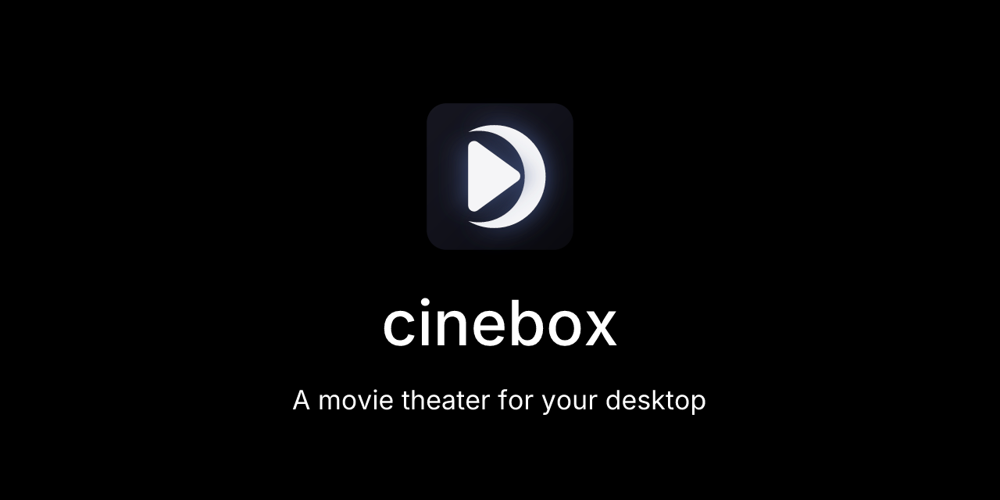
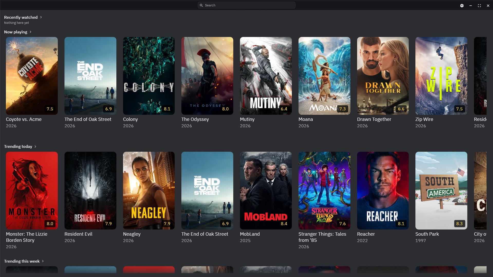
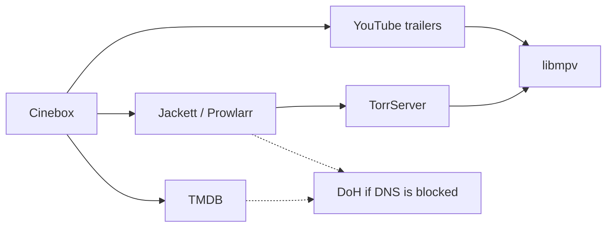

**English** | [Русский](README.ru.md)

[What and why](#what-and-why) | [Features](#features) | [How it works](#how-it-works) | [Install](#install) | [Architecture](#architecture) | [Roadmap](#roadmap) | [Contributing](#contributing) | [Disclaimer](#disclaimer)

   



## What and why

Cinebox is a native Windows app. Movie and series catalog, torrent search, and playback in one window: no browser, no extra player.

The stack is the same one people already use in **LAMPA MX**: TMDB, Jackett or Prowlarr, TorrServer. LAMPA is a website. It runs in a browser or a WebView, the built-in player handles few codecs and often stutters, so the stream almost always ends up in VLC or MPC-HC. The browser also eats RAM on its own.

TMDB is a separate story. In regions where `api.themoviedb.org` is DNS-blocked (including Russia), LAMPA goes through someone else's TMDB proxy. Cinebox talks to TMDB itself. If regular DNS cannot resolve the host, built-in DNS-over-HTTPS kicks in: you can set your own server, otherwise Quad9 / DNS.SB / AliDNS. No extra plugin and no third-party proxy.

## Features

**Catalog**

- Home screen: recently watched, now playing, trending (day and week), popular and top-rated
- Search for movies, series, and people, plus query history
- Title page: overview, runtime, rating, budget, countries, directors, cast, collection, recommendations, similar titles
- Actor and director pages
- Posters show if you already watched it; playback can resume from where you left off

**Playback**

- Built-in **libmpv**. For MKV, HEVC, HDR, and the rest of what usually sits in torrents, a second player is not needed
- Jackett or Prowlarr search. Filters: quality, HDR, Dolby Vision, subtitles, year, translation and voice, language. Sort by popularity, seeders, or size
- Streaming through TorrServer, optional preload wait, file list inside the torrent, play next automatically
- Audio and subtitle tracks, subtitle size and delay, speed 0.5x-2x, video scale, volume, loudness normalization
- Fullscreen. Controls hide if you leave the mouse alone. Seek 10 seconds with keys or by clicking the left/right third of the screen
- YouTube trailers in the same player

**App**

- UI languages: English, Russian, Ukrainian. TMDB catalog language follows the UI
- System proxy for TMDB and the parser. TorrServer always connects directly (usually a box on the LAN)
- DNS-block bypass via DoH for TMDB and the parser
- Settings can check the TMDB key, the parser, and TorrServer, run a speed test, and clear the cache
- `settings.json` and `cinebox.sqlite` sit next to the exe, so you can carry the folder around

## How it works



1. **Catalog.** Cinebox calls TMDB with your key: home, search, title pages, seasons, images. Responses and posters go into SQLite so a bad network does not force a full reload.
2. **Releases.** The Watch button sends the title to Jackett or Prowlarr. Quality, HDR, voice, and episodes are parsed out of release names, then the list is filtered on that.
3. **Stream.** The magnet goes to TorrServer. You can wait for preload, then the HTTP stream opens in libmpv. No browser in this path.
4. **Trailers.** TMDB gives a video id. Cinebox talks to YouTube InnerTube, deciphers the player JS signature, and feeds the media URLs into the same mpv.
5. **Network.** TMDB and the parser can use the system proxy. If that path fails and DNS bypass is on, the host is resolved over DoH and the request goes out direct. TorrServer is never proxied.

## Install

Get a Windows x64 build from **[GitHub Releases](https://github.com/dexsper/cinebox/releases)**. Unpack the archive and run `cinebox.exe`.

Cinebox does not ship TMDB, a parser, or TorrServer. You run those yourself:

| What | Settings | Typical URL |
| --- | --- | --- |
| [TMDB](https://www.themoviedb.org/settings/api) API key | TMDB | - |
| [Jackett](https://github.com/Jackett/Jackett) or [Prowlarr](https://github.com/Prowlarr/Prowlarr) | Parser | `http://127.0.0.1:9117` |
| [TorrServer](https://github.com/YouROK/TorrServer) | TorrServer | `http://127.0.0.1:8090` |

> [!IMPORTANT]
> TMDB wants the short API key (32 hex characters). A JWT access token will not work here.

On first launch, open Settings (gear) and fill in the key and URLs. Same screen can check the TMDB key, the parser, and ping TorrServer. If the catalog is empty because TMDB is blocked, leave DNS bypass on: it is on by default.

### Build from source

For hacking on the code, or if there is no release yet.

1. Windows 10/11 x64, [Rust](https://rustup.rs/) **1.95+**, MSVC C++ Build Tools (`lib.exe` on `PATH`).
2. Clone and run:

```bash
git clone https://github.com/dexsper/cinebox.git
cd cinebox
cargo run -p cinebox --release
```

The first Windows build downloads **libmpv** (about 30 MB) and builds `mpv.lib`. After that it lives in `crates/cinebox-player/mpv-src/` and is not downloaded again.

```bash
cargo test --workspace
```

## Architecture

The repo is split into crates. The window and screens live in `cinebox`, the rest are libraries.

| Crate | What it does |
| --- | --- |
| `cinebox` | Window (egui/eframe), screens, translations |
| `cinebox-core` | Models, `settings.json`, SQLite (cache and history) |
| `cinebox-tmdb` | TMDB requests |
| `cinebox-net` | HTTP: proxy, DoH, retries |
| `cinebox-indexer` | Jackett and Prowlarr |
| `cinebox-parse` | Release-name parse, voices, filters |
| `cinebox-torrserver` | TorrServer client |
| `cinebox-player` | libmpv over OpenGL |
| `cinebox-youtube` | YouTube InnerTube and signature decipher for libmpv |
| `cinebox-typograf` | Title typography (ru / en-US) |

## Roadmap

- [ ] Skip intro and credits
- [ ] Categories on the home screen, plus custom lists (Favorites, Watched)
- [ ] First-run wizard:
  - language
  - TMDB key
  - parser type and URL
  - TorrServer URL

## Contributing

Bugs and ideas go in Issues. Code changes go through a pull request.

1. Fork, branch off `master`.
2. Run `cargo test --workspace` before you push.
3. One PR per topic is better. If the change is large, open an issue first.
4. Do not commit keys, `settings.json`, or sqlite files.

If you touched SQLx `query!` or migrations, refresh offline data with `scripts/sqlx-prepare.ps1` (or `.sh`). You do not need to edit `.cargo/config.toml` for that.

## Disclaimer

Cinebox is a media player and a catalog. It does not host, upload, or distribute copyrighted content.
Users are responsible for what they open and for following the law.
This product uses the TMDB API but is not endorsed or certified by TMDB.
