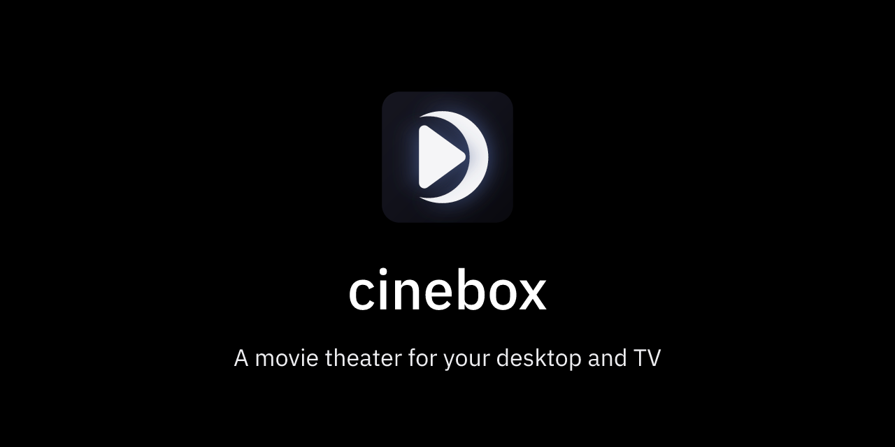
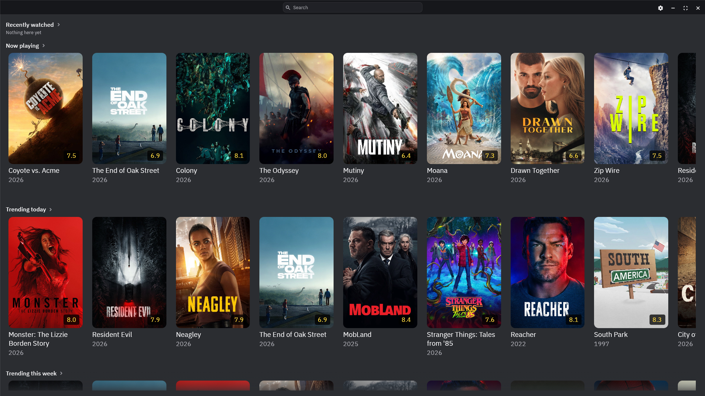
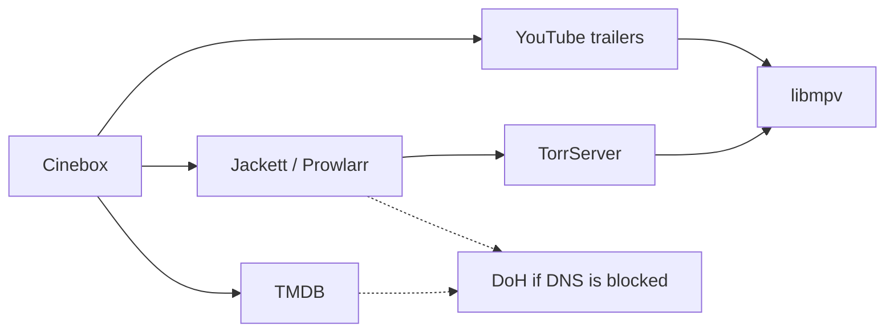

**English** | [Русский](README.ru.md)

[What and why](#what-and-why) | [Features](#features) | [How it works](#how-it-works) | [Install](#install) | [Architecture](#architecture) | [Roadmap](#roadmap) | [Contributing](#contributing) | [Disclaimer](#disclaimer)

    



## What and why

Cinebox is a native desktop app for Windows and Linux. Movie and series catalog, torrent search, and playback in one window: no browser, no extra player.

The stack is the same one people already use in **LAMPA MX**: TMDB, Jackett or Prowlarr, TorrServer. LAMPA is a website. It runs in a browser or a WebView, the built-in player handles few codecs and often stutters, so the stream almost always ends up in VLC or MPC-HC. The browser also eats RAM on its own.

TMDB is a separate story. In regions where `api.themoviedb.org` is DNS-blocked (including Russia), LAMPA goes through someone else's TMDB proxy. Cinebox talks to TMDB itself. If regular DNS cannot resolve the host, built-in DNS-over-HTTPS kicks in: you can set your own server, otherwise Quad9 / DNS.SB / AliDNS. No extra plugin and no third-party proxy.

## Features

**Catalog**

- Sections: Movies, Cartoons, Series, Anime, each with its own themed shelves
- Discover: filter by genre, decade, rating, and sort order
- Lists: Watching, Plan to watch, Completed, Dropped, and Liked
- Home: recently watched, your lists, trending, popular, top rated
- Search for movies, series, and people with query history
- Title pages with cast, collections, recommendations, and similar titles
- Actor and director pages
- Resume from the last position per movie or episode
- Optional timecode sync with TorrServer

**Playback**

- Built-in libmpv: MKV, HEVC, and HDR play without an external player
- Torrent search via Jackett or Prowlarr with quality, HDR, voice, and language filters
- Streaming through TorrServer with preload and auto-play of the next file
- Audio and subtitle tracks, subtitle delay, speed, scale, loudness normalization
- Track, speed, and scale choices remembered per torrent
- Fullscreen with auto-hiding controls and 10-second seek
- YouTube trailers in the same player
- Skip intro, recap, credits, and preview, with optional auto-skip

**App**

- English, Russian, and Ukrainian UI; TMDB content follows the UI language
- System proxy for TMDB and the parser; TorrServer always connects directly
- Built-in DNS-over-HTTPS to get around DNS blocks
- Connection checks for TMDB, the parser, and TorrServer, plus a speed test

## How it works


```mermaid
flowchart LR
  UI[Cinebox] --> TMDB[TMDB]
  UI --> Parser[Jackett / Prowlarr]
  Parser --> TS[TorrServer]
  TS --> MPV[libmpv]
  UI --> YT[YouTube trailers]
  YT --> MPV
  TMDB -.-> DoH[DoH if DNS is blocked]
  Parser -.-> DoH
```

1. **Catalog.** Cinebox calls TMDB with your key: home, sections, discover, search, title pages, seasons, images. Responses and posters go into SQLite so a bad network does not force a full reload.
2. **Releases.** The Watch button sends the title to Jackett or Prowlarr. Quality, HDR, voice, and episodes are parsed out of release names, then the list is filtered on that.
3. **Stream.** The magnet goes to TorrServer. You can wait for preload, then the HTTP stream opens in libmpv. No browser in this path.
4. **Watch history.** Progress is written to local SQLite as you watch, keyed by title or episode, not by torrent. If "Track timecode on server" is on, the same time is sent to TorrServer. On open, local position is preferred; otherwise the server's timecode is used.
5. **Player settings.** Open the same torrent again and the last audio track, subtitles, speed, and video scale come back. Subtitle size and delay last for the current playback only. Volume is app-wide.
6. **Trailers.** TMDB gives a video id. Cinebox talks to YouTube InnerTube, deciphers the player JS signature, and feeds the media URLs into the same mpv.
7. **Network.** TMDB and the parser can use the system proxy. If that path fails and DNS bypass is on, the host is resolved over DoH and the request goes out direct. TorrServer is never proxied.

## Install

Get a build from **[GitHub Releases](https://github.com/dexsper/cinebox/releases)**:

- **Windows x64:** unpack the zip and run `cinebox.exe`. Settings and the database stay in that folder.
- **Linux x86_64:** make the AppImage executable (`chmod +x`) and run it. Settings go to `~/.config/cinebox`, the database to `~/.local/share/cinebox`. Needs glibc 2.39+ (Ubuntu 24.04, Fedora 40, or newer).

Cinebox does not ship TMDB, a parser, or TorrServer. You run those yourself:

| What | Settings | Typical URL |
| --- | --- | --- |
| [TMDB](https://www.themoviedb.org/settings/api) API key | TMDB | - |
| [Jackett](https://github.com/Jackett/Jackett) or [Prowlarr](https://github.com/Prowlarr/Prowlarr) | Parser | `http://127.0.0.1:9117` |
| [TorrServer](https://github.com/YouROK/TorrServer) | TorrServer | `http://127.0.0.1:8090` |

> [!IMPORTANT]
> TMDB wants the short API key (32 hex characters). A JWT access token will not work here.

On first launch, open Settings (gear) and fill in the key and URLs. Same screen can check the TMDB key, the parser, and ping TorrServer. If the catalog is empty because TMDB is blocked, leave DNS bypass on: it is on by default.

### Build from source

For hacking on the code, or if there is no release yet.

1. [Rust](https://rustup.rs/) **1.95+** and the platform toolchain:
   - Windows 10/11 x64: MSVC C++ Build Tools (`lib.exe` on `PATH`).
   - Linux: libmpv 0.35+ with headers and `pkg-config`. Debian/Ubuntu: `sudo apt install pkg-config libmpv-dev libxkbcommon-dev libwayland-dev`.
2. Clone and run:

```bash
git clone https://github.com/dexsper/cinebox.git
cd cinebox
cargo run -p cinebox --release
```

The first Windows build downloads **libmpv** (about 30 MB) and builds `mpv.lib`. After that it lives in `crates/cinebox-player/mpv-src/` and is not downloaded again. On Linux the system libmpv is linked.

```bash
cargo test --workspace
```

## Architecture

The repo is split into crates. The window and screens live in `cinebox`, the rest are libraries.

| Crate | What it does |
| --- | --- |
| `cinebox` | Window (egui/eframe), screens, translations |
| `cinebox-core` | Models, `settings.json`, SQLite (cache, history, lists) |
| `cinebox-tmdb` | TMDB requests, section shelves, discover queries |
| `cinebox-net` | HTTP: proxy, DoH, retries |
| `cinebox-indexer` | Jackett and Prowlarr, release-name parse, voices, filters |
| `cinebox-torrserver` | TorrServer client, file/episode parse |
| `cinebox-player` | libmpv over OpenGL |
| `cinebox-youtube` | YouTube InnerTube and signature decipher for libmpv |
| `cinebox-skip` | Skip-segment data (TheIntroDB; extensible for other sources) |
| `cinebox-typograf` | Title typography (ru / en-US) |

## Roadmap

- [ ] Skip intro and credits
  - [x] Third-party API (TheIntroDB)
  - [ ] Custom Chromaprint-based analyzer
- [x] Categories on the home screen, plus custom lists (Favorites, Watched)
- [ ] First-run wizard
- [x] Linux build

## Contributing

Bugs and ideas go in Issues. Code changes go through a pull request.

1. Fork, branch off `master`.
2. Run `cargo test --workspace` before you push.
3. One PR per topic is better. If the change is large, open an issue first.
4. Do not commit keys, `settings.json`, or sqlite files.

If you touched SQLx `query!` or migrations, refresh offline data with `scripts/sqlx-prepare`

## Disclaimer

Cinebox is a media player and a catalog. It does not host, upload, or distribute copyrighted content.
Users are responsible for what they open and for following the law.
This product uses the TMDB API but is not endorsed or certified by TMDB.
