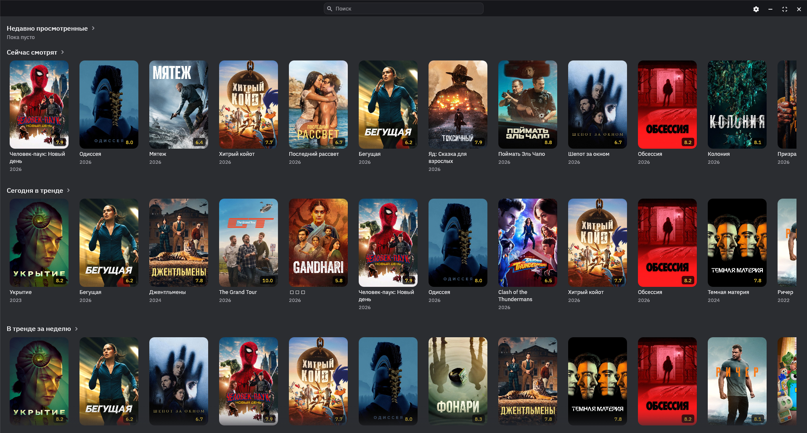
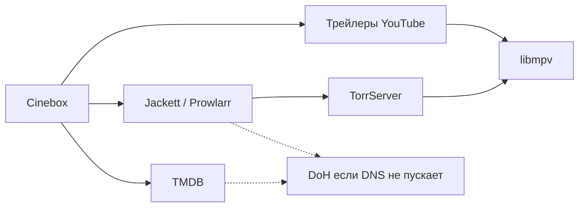

[English](README.md) | **Русский**

[Что и зачем](#что-это-и-зачем) | [Возможности](#возможности) | [Как это работает](#как-это-работает) | [Установка](#установка) | [Архитектура](#архитектура) | [Планы](#планы) | [Как помочь](#как-помочь) | [Отказ от ответственности](#отказ-от-ответственности)




## Что это и зачем

Cinebox - нативное приложение для Windows. Каталог фильмов и сериалов, поиск раздач и просмотр в одном окне, без браузера и без отдельного плеера.

По стеку это то же самое, к чему все привыкли в **LAMPA MX**: TMDB, Jackett или Prowlarr, TorrServer. Но LAMPA - сайт. Она открывается в браузере или в WebView, встроенный плеер мало какие кодеки умеет и часто тормозит, поэтому почти всегда поток уходит в VLC или MPC-HC. Плюс сам браузер отдельно ест память.

С TMDB отдельная история. В регионах, где `api.themoviedb.org` режут по DNS (в том числе в РФ), LAMPA ходит через чужой TMDB-прокси. Cinebox ходит на TMDB сам. Если обычный DNS хост не резолвит, срабатывает встроенный DNS-over-HTTPS: можно указать свой сервер, иначе Quad9 / DNS.SB / AliDNS. Отдельный плагин и чужой прокси не нужны.

## Возможности

**Каталог**

- На главной: недавно просмотренные, сейчас в кино, тренды за день и за неделю, популярное и с высоким рейтингом
- Поиск по фильмам, сериалам и людям, плюс история запросов
- Карточка фильма или сериала: описание, длительность, рейтинг, бюджет, страны, режиссеры, актеры, коллекция, рекомендации, похожие
- Можно открыть страницу актера или режиссера
- На постере видно, если уже смотрели; можно продолжить с того места

**Просмотр**

- Встроенный **libmpv**. Для MKV, HEVC, HDR и прочего, что обычно лежит в раздачах, второй плеер не нужен
- Поиск в Jackett или Prowlarr. Фильтры: качество, HDR, Dolby Vision, субтитры, год, перевод и озвучка, язык. Сортировка по популярности, сидам или размеру
- Стрим через TorrServer, можно подождать прелоад, список файлов в торренте, автопереход к следующему
- Звуковые дорожки и субтитры, размер и сдвиг субтитров, скорость 0.5x-2x, масштаб картинки, громкость, нормализация звука
- Полный экран. Панель управления прячется, если не трогать мышь. Перемотка на 10 секунд клавишами или кликом по левой/правой трети экрана
- Трейлеры с YouTube в том же плеере

**Приложение**

- Языки интерфейса: русский, английский, украинский. Язык каталога TMDB берется тот же
- Системный прокси для TMDB и парсера. TorrServer всегда напрямую (обычно это машина в локалке)
- Обход DNS-блокировок через DoH для TMDB и парсера
- В настройках можно проверить ключ TMDB, парсер и TorrServer, прогнать спидтест и почистить кэш
- `settings.json` и `cinebox.sqlite` лежат рядом с exe, папку можно носить с собой


## Как это работает




1. **Каталог.** Cinebox ходит в TMDB по вашему ключу: главная, поиск, карточки, сезоны, картинки. Ответы и постеры складываются в SQLite, чтобы при плохой сети не грузить все заново.
2. **Раздачи.** По кнопке "Смотреть" название уходит в Jackett или Prowlarr. Из имен релизов вытаскиваются качество, HDR, озвучка, серии, и уже по этому фильтруется список.
3. **Стрим.** Magnet отдается в TorrServer. Можно подождать прелоад, потом HTTP-поток открывается в libmpv. Браузер в этой схеме не участвует.
4. **Трейлеры.** С TMDB приходит ключ ролика, Cinebox достает подписанные ссылки YouTube и открывает их в том же mpv.
5. **Сеть.** TMDB и парсер могут идти через системный прокси. Если этот путь не проходит и включен обход DNS, хост резолвится по DoH и запрос уходит напрямую. TorrServer без прокси.


## Установка

Сборку под Windows x64 качайте в **[GitHub Releases](https://github.com/dexsper/cinebox/releases)**. Распаковали архив, запускаете `cinebox.exe`.

Сам Cinebox не ставит TMDB, парсер и TorrServer, их нужно поднять отдельно:


| Что                                                                                                | Куда в настройках | Типичный адрес          |
| -------------------------------------------------------------------------------------------------- | ----------------- | ----------------------- |
| Ключ [TMDB](https://www.themoviedb.org/settings/api)                                               | TMDB              | -                       |
| [Jackett](https://github.com/Jackett/Jackett) или [Prowlarr](https://github.com/Prowlarr/Prowlarr) | Парсер            | `http://127.0.0.1:9117` |
| [TorrServer](https://github.com/YouROK/TorrServer)                                                 | TorrServer        | `http://127.0.0.1:8090` |


> [!IMPORTANT]
> В TMDB нужен короткий API-ключ (32 шестнадцатеричных символа). JWT-токен сюда не подходит.

При первом запуске откройте настройки (шестеренка) и пропишите ключ и адреса. Там же можно проверить ключ TMDB, парсер и пингануть TorrServer. Если каталог пустой из-за блокировки TMDB, не выключайте обход DNS - по умолчанию он включен.

### Сборка из исходников

Нужно, если собираетесь править код или релиза еще нет.

1. Windows 10/11 x64, [Rust](https://rustup.rs/) **1.95+**, MSVC C++ Build Tools (`lib.exe` должен быть в `PATH`).
2. Клонировать и запустить:

```bash
git clone https://github.com/dexsper/cinebox.git
cd cinebox
cargo run -p cinebox --release
```

Первая сборка на Windows скачает **libmpv** (около 30 МБ) и соберет `mpv.lib`. Потом это лежит в `crates/cinebox-player/mpv-src/` и заново не качается.

```bash
cargo test --workspace
```


## Архитектура

Репозиторий разбит на несколько крейтов. Окно и экраны живут в `cinebox`, остальное - библиотеки.


| Крейт                | Что делает                                      |
| -------------------- | ----------------------------------------------- |
| `cinebox`            | Окно (egui/eframe), экраны, переводы            |
| `cinebox-core`       | Модели, `settings.json`, SQLite (кэш и история) |
| `cinebox-tmdb`       | Запросы к TMDB                                  |
| `cinebox-net`        | HTTP: прокси, DoH, повторы                      |
| `cinebox-indexer`    | Jackett и Prowlarr                              |
| `cinebox-parse`      | Разбор названий раздач, озвучки, фильтры        |
| `cinebox-torrserver` | Клиент TorrServer                               |
| `cinebox-player`     | libmpv через OpenGL                             |
| `cinebox-youtube`    | YouTube InnerTube и расшифровка подписи для libmpv |
| `cinebox-typograf`   | Типографика заголовков (ru / en-US)             |

## Планы

- [ ] Пропуск заставки и титров
- [ ] Категории на главной и свои списки (Избранное, Просмотрено)
- [ ] Мастер первого запуска:
  - язык
  - ключ TMDB
  - тип парсера и адрес
  - адрес TorrServer


## Как помочь

Баги и идеи - в Issues. Правки кода - через pull request.

1. Форк, ветка от `master`.
2. Перед пушем прогоните `cargo test --workspace`.
3. Лучше один PR на одну тему. Если правка большая, сначала issue.
4. Ключи, `settings.json` и sqlite в коммит не кладите.

Если трогали SQLx `query!` или миграции, обновите офлайн-данные скриптом `scripts/sqlx-prepare.ps1` (или `.sh`). `.cargo/config.toml` для этого не нужен.

## Отказ от ответственности

Cinebox - медиаплеер и каталог. Он не размещает, не загружает и не распространяет защищенный авторским правом контент.
Пользователи сами отвечают за то, что открывают, и за соблюдение законов.
Продукт использует TMDB API, но не одобрен и не сертифицирован TMDB.