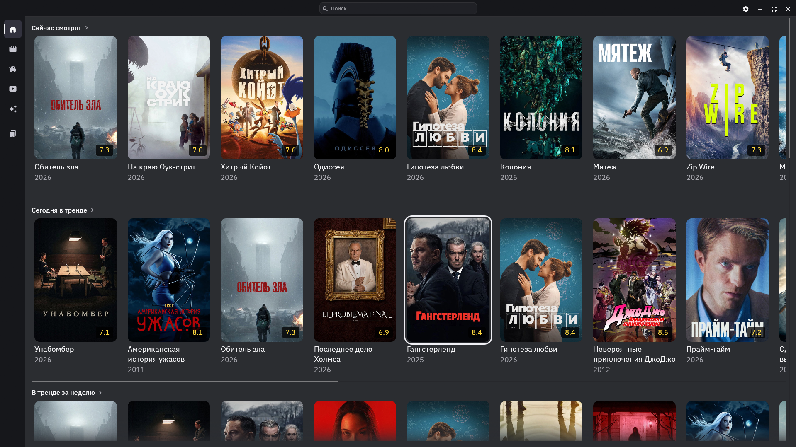
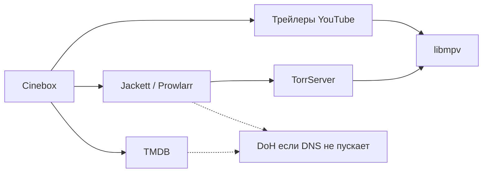

[English](README.md) | **Русский**

[Что и зачем](#что-это-и-зачем) | [Возможности](#возможности) | [Как это работает](#как-это-работает) | [Установка](#установка) | [Архитектура](#архитектура) | [Планы](#планы) | [Как помочь](#как-помочь) | [Отказ от ответственности](#отказ-от-ответственности)

    



## Что это и зачем

Cinebox - нативное приложение для Windows и Linux. Каталог фильмов и сериалов, поиск раздач и просмотр в одном окне, без браузера и без отдельного плеера.

По стеку это то же самое, к чему все привыкли в **LAMPA MX**: TMDB, Jackett или Prowlarr, TorrServer. Но LAMPA - сайт. Она открывается в браузере или в WebView, встроенный плеер мало какие кодеки умеет и часто тормозит, поэтому почти всегда поток уходит в VLC или MPC-HC. Плюс сам браузер отдельно ест память.

С TMDB отдельная история. В регионах, где `api.themoviedb.org` режут по DNS (в том числе в РФ), LAMPA ходит через чужой TMDB-прокси. Cinebox ходит на TMDB сам. Если обычный DNS хост не резолвит, срабатывает встроенный DNS-over-HTTPS: можно указать свой сервер, иначе Quad9 / DNS.SB / AliDNS. Отдельный плагин и чужой прокси не нужны.

## Возможности

**Каталог**

- Разделы: Фильмы, Мультфильмы, Сериалы, Аниме, в каждом свои подборки
- Подбор по жанрам, десятилетию, рейтингу и сортировке
- Списки: Смотрю, Запланировано, Просмотрено, Брошено и Нравится
- Главная: недавно просмотренные, ваши списки, тренды, популярное, лучшее
- Поиск фильмов, сериалов и людей с историей запросов
- Карточка тайтла: актеры, коллекция, рекомендации, похожее
- Страницы актеров и режиссеров
- Продолжение с места остановки для фильма или серии
- Опциональная синхронизация таймкода с TorrServer

**Просмотр**

- Встроенный libmpv: MKV, HEVC и HDR без внешнего плеера
- Поиск раздач в Jackett или Prowlarr с фильтрами по качеству, HDR, озвучке и языку
- Стрим через TorrServer с прелоадом и автопереходом к следующему файлу
- Дорожки и субтитры, задержка субтитров, скорость, масштаб, нормализация звука
- Выбор дорожек, скорости и масштаба запоминается для раздачи
- Полный экран, автоскрытие панели, перемотка на 10 секунд
- Трейлеры с YouTube в том же плеере
- Пропуск интро, "ранее", титров и превью, с автопропуском

**Приложение**

- Интерфейс на русском, английском и украинском, TMDB на том же языке
- Системный прокси для TMDB и парсера, TorrServer всегда напрямую
- Встроенный DNS-over-HTTPS для обхода DNS-блокировок
- Проверка подключения к TMDB, парсеру и TorrServer, спидтест

## Как это работает


```mermaid
flowchart LR
  UI[Cinebox] --> TMDB[TMDB]
  UI --> Parser[Jackett / Prowlarr]
  Parser --> TS[TorrServer]
  TS --> MPV[libmpv]
  UI --> YT[Трейлеры YouTube]
  YT --> MPV
  TMDB -.-> DoH[DoH если DNS не пускает]
  Parser -.-> DoH
```


1. **Каталог.** Cinebox ходит в TMDB по вашему ключу: главная, разделы, подбор, поиск, карточки, сезоны, картинки. Ответы и постеры складываются в SQLite, чтобы при плохой сети не грузить все заново.
2. **Раздачи.** По кнопке "Смотреть" название уходит в Jackett или Prowlarr. Из имен релизов вытаскиваются качество, HDR, озвучка, серии, и уже по этому фильтруется список.
3. **Стрим.** Magnet отдается в TorrServer. Можно подождать прелоад, потом HTTP-поток открывается в libmpv. Браузер в этой схеме не участвует.
4. **История.** Позиция пишется в локальный SQLite по фильму или серии, не по торренту. Если в настройках включено "Вести таймкод на сервере", то же время уходит в TorrServer. При открытии локальная позиция важнее серверной.
5. **Настройки плеера.** Откроете ту же раздачу снова - вернутся выбранные звуковая дорожка, субтитры, скорость и масштаб картинки. Размер и сдвиг субтитров действуют только в текущем просмотре. Громкость общая для приложения.
6. **Трейлеры.** С TMDB приходит ключ ролика, Cinebox достает подписанные ссылки YouTube и открывает их в том же mpv.
7. **Сеть.** TMDB и парсер могут идти через системный прокси. Если этот путь не проходит и включен обход DNS, хост резолвится по DoH и запрос уходит напрямую. TorrServer без прокси.


## Установка

Сборки лежат в **[GitHub Releases](https://github.com/dexsper/cinebox/releases)**:

- **Windows x64:** распакуйте zip и запустите `cinebox.exe`. Настройки и база хранятся в той же папке.
- **Linux x86_64:** сделайте AppImage исполняемым (`chmod +x`) и запустите. Настройки в `~/.config/cinebox`, база в `~/.local/share/cinebox`. Нужен glibc 2.39+ (Ubuntu 24.04, Fedora 40 или новее).

Сам Cinebox не ставит TMDB, парсер и TorrServer, их нужно поднять отдельно:


| Что                                                                                                | Куда в настройках | Типичный адрес          |
| -------------------------------------------------------------------------------------------------- | ----------------- | ----------------------- |
| Ключ [TMDB](https://www.themoviedb.org/settings/api)                                               | TMDB              | -                       |
| [Jackett](https://github.com/Jackett/Jackett) или [Prowlarr](https://github.com/Prowlarr/Prowlarr) | Парсер            | `http://127.0.0.1:9117` |
| [TorrServer](https://github.com/YouROK/TorrServer)                                                 | TorrServer        | `http://127.0.0.1:8090` |


> [!IMPORTANT]
> В TMDB нужен короткий API-ключ (32 шестнадцатеричных символа). JWT-токен сюда не подходит.

При первом запуске откройте настройки (шестеренка) и пропишите ключ и адреса. Там же можно проверить ключ TMDB, парсер и пингануть TorrServer. Если каталог пустой из-за блокировки TMDB, не выключайте обход DNS - по умолчанию он включен.

### Сборка из исходников

Нужно, если собираетесь править код или релиза еще нет.

1. [Rust](https://rustup.rs/) **1.95+** и инструменты платформы:
   - Windows 10/11 x64: MSVC C++ Build Tools (`lib.exe` должен быть в `PATH`).
   - Linux: libmpv 0.35+ с заголовками и `pkg-config`. Debian/Ubuntu: `sudo apt install pkg-config libmpv-dev libxkbcommon-dev libwayland-dev`.
2. Клонировать и запустить:

```bash
git clone https://github.com/dexsper/cinebox.git
cd cinebox
cargo run -p cinebox --release
```

Первая сборка на Windows скачает **libmpv** (около 30 МБ) и соберет `mpv.lib`. Потом это лежит в `crates/cinebox-player/mpv-src/` и заново не качается. На Linux используется системная libmpv.

```bash
cargo test --workspace
```


## Архитектура

Репозиторий разбит на несколько крейтов. Окно и экраны живут в `cinebox`, остальное - библиотеки.


| Крейт                | Что делает                                      |
| -------------------- | ----------------------------------------------- |
| `cinebox`            | Окно (egui/eframe), экраны, переводы            |
| `cinebox-core`       | Модели, `settings.json`, SQLite (кэш, история, списки) |
| `cinebox-tmdb`       | Запросы к TMDB, подборки разделов, подбор       |
| `cinebox-net`        | HTTP: прокси, DoH, повторы                      |
| `cinebox-indexer`    | Jackett и Prowlarr, разбор названий раздач, озвучки, фильтры |
| `cinebox-torrserver` | Клиент TorrServer, разбор файлов/серий          |
| `cinebox-player`     | libmpv через OpenGL                             |
| `cinebox-youtube`    | YouTube InnerTube и расшифровка подписи для libmpv |
| `cinebox-skip`       | Данные о сегментах для пропуска (TheIntroDB; расширяемо) |
| `cinebox-typograf`   | Типографика заголовков (ru / en-US)             |

## Планы

- [ ] Пропуск заставки и титров
  - [x] Сторонний API (TheIntroDB)
  - [ ] Свой анализатор на Chromaprint
- [x] Категории на главной и свои списки (Избранное, Просмотрено)
- [ ] Мастер первого запуска
- [x] Сборка под Linux


## Как помочь

Баги и идеи - в Issues. Правки кода - через pull request.

1. Форк, ветка от `master`.
2. Перед пушем прогоните `cargo test --workspace`.
3. Лучше один PR на одну тему. Если правка большая, сначала issue.
4. Ключи, `settings.json` и sqlite в коммит не кладите.

Если трогали SQLx `query!` или миграции, обновите офлайн-данные скриптом `scripts/sqlx-prepare`

## Отказ от ответственности

Cinebox - медиаплеер и каталог. Он не размещает, не загружает и не распространяет защищенный авторским правом контент.
Пользователи сами отвечают за то, что открывают, и за соблюдение законов.
Продукт использует TMDB API, но не одобрен и не сертифицирован TMDB.